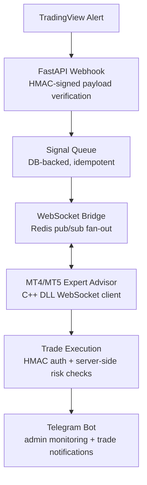

<p align="center">
  
</p>

<p align="center">
  <a href="https://github.com/TheFractalyst/PineTunnel/actions/workflows/test.yml"></a>
  <a href="https://github.com/TheFractalyst/PineTunnel/actions/workflows/build-dll.yml"></a>
  <a href="https://github.com/TheFractalyst/PineTunnel/actions/workflows/build-ea.yml"></a>
  
  <a href="https://python.org"></a>
  <a href="https://fastapi.tiangolo.com"></a>
  <a href="LICENSE"></a>
</p>

<p align="center"><em>Relay TradingView webhook signals to MetaTrader 4/5 for automated order execution.</em></p>

<p align="center">
  <a href="#quick-start">Quick Start</a> &middot;
  <a href="#architecture">Architecture</a> &middot;
  <a href="#api">API</a> &middot;
  <a href="#documentation">Docs</a> &middot;
  <a href="https://pinetunnel.com">Website</a>
</p>

---

## One Command. Two Minutes. Fully Functional.

```bash
pip install pinetunnel
pinetunnel
```

That's it. The setup wizard handles everything: dependencies, Redis, security keys, database, Telegram bot, OS service (24/7 auto-start), and EA installation. No Docker, no manual config, no DevOps experience needed.

**What you get after setup:**
- FastAPI server running 24/7 on your VPS (survives reboots via systemd/launchd)
- Telegram bot for real-time trade notifications and monitoring
- HTTPS webhook URL for TradingView alerts
- RC4 signal encryption (key generated automatically)
- OS service auto-start on boot

**What you need:**
- A VPS (any OS: Linux, macOS, Windows)
- A Telegram bot token from @BotFather (the setup walks you through it)

---

TradingView is the most popular charting platform for retail traders. MetaTrader 4/5 dominates retail forex/CFD broker terminals. But **TradingView can't place trades on MetaTrader directly** - there is no native integration.

PineTunnel closes this gap:

- **Sub-second relay** from TradingView alert to MT4/MT5 order via WebSocket
- **40+ trading commands**: market orders, pending orders, partial close, breakeven, trailing stops, ATR-based stops
- **Idempotent execution**: duplicate webhook retries are deduplicated - no duplicate trades
- **RC4 signal encryption**: alerts encrypted in PineScript, decrypted on server (plaintext also supported)
- **Telegram admin bot**: mandatory - real-time trade notifications, monitoring, signal tracking
- **24/7 auto-start**: OS service (systemd/launchd/sc.exe) installed automatically, survives reboots
- **Dual MT4/MT5 support**: separate MQL4 and MQL5 codebases with identical functionality
- **C++ DLL integration**: MetaTrader has no native WebSocket support - a custom C++ DLL implements it

**Example webhook payload (CSV format):**

```
YOUR_KEY,buy,EURUSD,lots=0.10,sl=1.0850,tp=1.0950,comment=mytrade,secret=YOUR_SECRET
```

## Architecture



A TradingView alert hits the FastAPI webhook endpoint. The signal is parsed, validated, and queued in a persistent database-backed queue. The WebSocket bridge relays it to the MT4/MT5 Expert Advisor running inside MetaTrader, which executes the trade via a custom C++ DLL. The Telegram bot notifies admins of results, failures, and connection status changes.

---

## Table of Contents

- [Quick Start](#quick-start)
- [Architecture](#architecture)
- [API](#api)
- [Tech Stack](#tech-stack)
- [Configuration](#configuration)
- [Engineering Challenges](#engineering-challenges)
- [Observability](#observability)
- [Security](#security)
- [Project Structure](#project-structure)
- [CI/CD](#cicd)
- [Documentation](#documentation)
- [For AI Coding Assistants](#for-ai-coding-assistants)
- [Contributing](#contributing)
- [License](#license)

## Quick Start

### The only command you need

```bash
pip install pinetunnel
pinetunnel
```

The auto-setup runs 5 steps automatically:

1. **Server** - installs deps, starts Redis, generates .env (chmod 600), runs migrations, starts daemon, verifies health
2. **Webhook URL** - Public IP (HTTP, zero cost) or Cloudflare domain (HTTPS, persistent)
3. **Telegram bot** - paste bot token + admin user ID from @BotFather (required, not optional)
4. **OS service** - installs systemd / launchd / sc.exe automatically (24/7 auto-start on boot)
5. **EA install** - auto-detects MetaTrader on Windows and copies .ex5/.ex4 + DLL

### Alternative install (from source)

```bash
git clone https://github.com/TheFractalyst/PineTunnel.git
cd PineTunnel && pip install -e ".[all]"
pinetunnel
```

### CLI commands

```
pinetunnel              First run: auto-setup (5 steps, 2 minutes)
pinetunnel start        Start server (foreground)
pinetunnel start --daemon   Start as background daemon
pinetunnel stop         Stop the daemon
pinetunnel status       Check if running + health probe
pinetunnel check        Health checks (deps, Redis, .env, DB, server)
pinetunnel test         Send a test webhook signal
pinetunnel migrate      Run database migrations
pinetunnel guide        Print the full setup guide
pinetunnel version      Show version + platform info
pinetunnel install-service     Install as OS service (auto-start on boot)
pinetunnel uninstall-service   Remove OS service
pinetunnel install-ea   Auto-detect MetaTrader and install EA + DLL
pinetunnel setup-cloudflare   Set up Cloudflare DNS or tunnel for HTTPS
pinetunnel stop-cloudflare     Stop Cloudflare tunnel
pinetunnel setup-proxy   Set up nginx reverse proxy and Let's Encrypt SSL
```

### Send a test alert

```bash
curl -X POST http://127.0.0.1:8000/ \
  -H "Content-Type: text/plain" \
  -d 'YOUR_KEY,buy,EURUSD,lots=0.10,sl=1.0850,tp=1.0950,comment=test,secret=YOUR_SECRET'
```

### Install the EA on MetaTrader

1. Copy `PineTunnel_EA.ex5` (MT5) or `PineTunnel_EA_MT4.ex4` (MT4) to your `MQL5/Experts` or `MQL4/Experts` folder
2. Copy `PTWebSocket.dll` to `MQL5/Libraries` or `MQL4/Libraries`
3. Restart MetaTrader, attach the EA to a chart
4. Set `InpLicenseID` and `InpServerURL` in the EA inputs
5. Enable DLL imports: Tools -> Options -> Expert Advisors -> Allow DLL imports

See [EA Setup Guide](docs/EA_SETUP.md) for detailed steps.

## API

Key endpoints:

| Endpoint | Method | Auth | Description |
|----------|--------|------|-------------|
| `/webhook` | POST | Webhook secret | Receive TradingView alerts |
| `/ws/{license_key}` | WS | License key | Real-time signal push to EA |
| `/health` | GET | None | Server health (DB, Redis) |
| `/api/signals/{license_key}` | GET | License key | EA polling: fetch pending signals |
| `/api/ea/download/{platform}` | GET | License key | Download EA compiled file |
| `/api/trades/report` | POST | License + secret | Trade execution report from EA |
| `/metrics` | GET | None | Prometheus metrics |
| `/api/diagnostics` | GET | Admin key | Full system diagnostics (8 probes) |
| `/api/admin/replay` | POST | Admin key | Inject test signal into live pipeline |
| `/.well-known/security.txt` | GET | None | Security contact info |

<details>
<summary><b>Full API surface (34 endpoints)</b></summary>

| Endpoint | Method | Auth | Description |
|----------|--------|------|-------------|
| `/webhook` | POST | Webhook secret | Receive TradingView alerts (JSON body) |
| `/` | POST | Webhook secret | Root webhook (plain text or JSON) |
| `/ws/{license_key}` | WS | License key | Real-time signal push to EA |
| `/health` | GET | None | Server health (DB, Redis) |
| `/health/live` | GET | None | Liveness probe |
| `/health/ready` | GET | None | Readiness probe |
| `/api/signals/{license_key}` | GET | License key | EA polling: fetch pending signals |
| `/api/signals-longpoll/{license_key}` | GET | License key | Long-poll signal fetch |
| `/api/signals/{license_key}/{signal_id}` | DELETE | License key | Acknowledge processed signal |
| `/api/signals-batch-ack/{license_key}` | POST | License key | Batch acknowledge signals |
| `/api/ea/check/{platform}` | GET | License key | Lightweight EA version check |
| `/api/ea/download/{platform}` | GET | License key | Download EA compiled file (base64) |
| `/api/ea/download/{user_id}/{platform}/{sig}` | GET | Signed token | Download EA + DLL (zip) via persistent link |
| `/api/ea/audit/{license_key}` | POST | License key | EA audit logging |
| `/api/ea/dll/{platform}` | GET | Admin key | DLL version info |
| `/api/ea/dll/download/{platform}` | GET | License key | Download DLL file |
| `/api/trades/report` | POST | License + secret | Receive trade execution report from EA |
| `/api/trades/close` | POST | License + secret | Receive trade close notification |
| `/api/trades/stats` | POST | License + secret | Receive account stats from EA |
| `/api/admin/rate-limits` | GET | Admin key | Rate limit statistics per IP |
| `/api/admin/rate-limits/{ip}` | DELETE | Admin key | Reset rate limit for IP |
| `/api/admin/rate-limits/{ip}/reset` | POST | Admin key | Reset rate limit for IP (POST) |
| `/api/logs/errors` | GET | Session | Error logs |
| `/api/audit/actions` | GET | Session | Admin audit logs |
| `/api/database/stats` | GET | Session | Database table sizes and row counts |
| `/api/auth/sessions` | GET | Session | Active auth sessions |
| `/api/auth/logs` | GET | Session | Auth access logs |
| `/api/connections` | GET | Session | WebSocket connections overview |
| `/api/ea/ws-telemetry/open-positions/{license_key}` | GET | Admin key | Open positions for a connection |
| `/api/ea/ws-telemetry/trade-history/{license_key}` | GET | Admin key | Trade history for a connection |
| `/api/ea/ws-telemetry/signal-log/{license_key}` | GET | Admin key | Signal delivery log for a connection |
| `/api/ea/ws-telemetry/health/{license_key}` | GET | Admin key | WebSocket connection health |
| `/api/admin/replay/batch` | POST | Admin key | Batch inject test signals (max 50) |
| `/api/admin/replay/results` | GET | Admin key | Recent replay delivery results |
| `/.well-known/security.txt` | GET | None | Security contact info |

</details>

## Tech Stack

| Technology | Role |
|------------|------|
| Python 3.13 | Backend language, async throughout |
| FastAPI | Async web framework with middleware pipeline |
| Redis | WebSocket connection state, pub/sub messaging, rate limiting |
| SQLAlchemy 2.0 | Raw SQL via `text()` with dual DB support (SQLite + PostgreSQL) |
| Alembic | 7 database migrations |
| C++ (CMake) | WebSocket DLL for MT5 (x64) and MT4 (x86) |
| MQL5/MQL4 | Expert Advisor: order execution, partial close, trailing stops, ATR |
| python-telegram-bot | Admin bot (mandatory - trade notifications + monitoring) |
| GitHub Actions | CI/CD: DLL compilation (Windows), EA compilation (MetaEditor) |
| Uvicorn | Production ASGI server |

## Configuration

All values are auto-generated by `pinetunnel` setup. No manual editing needed.

| Variable | Required | Description |
|----------|----------|-------------|
| `WEBHOOK_SECRET` | Yes | Shared secret for TradingView webhook verification (32+ chars) |
| `JWT_SECRET` | Yes | JWT token signing key (32+ chars) |
| `ADMIN_API_KEY` | Yes | Admin API endpoint authentication (32+ chars) |
| `SERVER_BASE_URL` | Yes | Public URL of your server (for EA download links) |
| `HOST` | Yes | Bind address (default: 127.0.0.1, use 0.0.0.0 for public IP) |
| `SIGNAL_ENCRYPTION_KEY` | Yes | RC4 encryption key for PineScript signals (64-char hex) |
| `TELEGRAM_BOT_TOKEN` | Yes | Telegram bot token from @BotFather |
| `TELEGRAM_ADMIN_IDS` | Yes | Comma-separated Telegram admin user IDs |
| `REDIS_URL` | No | Redis connection URL (default: localhost:6379) |
| `DATABASE_URL` | No | PostgreSQL URL (default: SQLite local file) |

---

## Engineering Challenges

<details>
<summary><b>Idempotent signal execution</b></summary>

TradingView retries webhook delivery on timeout. Without deduplication, a single alert could place multiple trades. The signal queue computes a content hash (excluding the secret field) and stores it with status `acknowledged` before execution. A retry within the dedup window is detected and rejected; the EA never sees it.

</details>

<details>
<summary><b>WebSocket state recovery</b></summary>

When the server restarts or a Uvicorn worker recycles, EA connections drop. Redis stores connection state (license key, EA version, last seen) so any worker can recover the connection table. The EA reconnects automatically with exponential backoff.

</details>

<details>
<summary><b>Multi-worker WebSocket fan-out</b></summary>

The webhook hits worker A, but the EA's WebSocket is on worker B. Redis pub/sub broadcasts signals to all workers, ensuring delivery regardless of which worker receives the webhook.

</details>

<details>
<summary><b>Dual-database architecture</b></summary>

SQLite and PostgreSQL share a common async base class (`DatabaseManager`) with identical method signatures. Alembic migrations run on both. The `DATABASE_URL` env var selects the backend - no code changes needed between dev and production.

</details>

<details>
<summary><b>C++ DLL integration into MetaTrader</b></summary>

MetaTrader doesn't natively support WebSocket or HTTP client libraries. The C++ DLL (`PTWebSocket.dll`) implements a WebSocket client using WinHTTP, compiled for both x64 (MT5) and x86 (MT4) via CMake. The MQL5 EA loads the DLL and calls its functions via `#import`.

</details>

<details>
<summary><b>HMAC-signed EA protocol</b></summary>

Every message between server and EA is HMAC-SHA256 signed. The server verifies signatures with `hmac.compare_digest()` (constant-time) to prevent timing attacks. Messages include a timestamp with skew check to detect replay attacks.

</details>

<details>
<summary><b>RC4 signal encryption (PineScript to server)</b></summary>

Signals can be RC4-encrypted in PineScript before sending to TradingView. The server auto-detects encrypted messages (prefix `RC4,`) and decrypts before parsing. Plaintext signals are still accepted (backward compatible). RC4-drop256 is used to mitigate FMS early-bias attacks. The encryption key is generated by `pinetunnel setup` and displayed for the user to paste into PineScript's `encKey` input field.

</details>

## Observability

### Prometheus Metrics (`/metrics`)

The server exports Prometheus-compatible metrics at `/metrics` for scraping by Prometheus/Grafana/Zabbix. No external dependency - the text exposition format is implemented directly.

```
pinetunnel_http_requests_total{method,path,status}      - Counter
pinetunnel_http_request_duration_seconds{method,path}    - Histogram (10 buckets)
pinetunnel_webhook_signals_total{command,result}         - Counter
pinetunnel_signal_queue_depth                            - Gauge
pinetunnel_websocket_connections                         - Gauge
pinetunnel_websocket_signals_delivered_total             - Counter
pinetunnel_redis_operations_total{operation,result}      - Counter
pinetunnel_db_queries_total                              - Counter
```

### Diagnostics (`/api/diagnostics`)

Admin endpoint that probes all subsystems concurrently and reports status with per-component latency:

| Probe | Checks |
|-------|--------|
| database | `SELECT 1` round-trip |
| redis | `PING` round-trip |
| websocket_hub | connection count |
| signal_queue | pending signal count |
| rate_limiter | initialized state |
| client_manager | registered client count |
| disk | data dir usage % |
| memory | process RSS |

Public version at `/api/diagnostics/public` returns only overall status (no auth required).

### Signal Data Validation

All signals pass through a validation layer before queuing. Rejects impossible signals that would fail at the broker:

- Symbol format (uppercase, 2-32 alphanumeric chars)
- Volume bounds (lots 0-1000, risk 0-100%)
- SL/TP direction (buy SL < entry < TP, sell SL > entry > TP)
- SL/TP distance sanity (rejects 50%+ stops to catch fat-finger errors)
- Pending order entry price required for pending commands

Rejected signals return `422` with the validation reason.

### Signal Replay (`/api/admin/replay`)

Admin endpoint to inject test signals into the live pipeline without TradingView. Verifies end-to-end delivery: parser -> validator -> queue -> WebSocket -> EA response.

## Security

- Server defaults to 127.0.0.1 (localhost only, not exposed to internet)
- .env file chmod 600 (owner-only read/write)
- SQLite database file chmod 600
- HMAC-SHA256 on all EA communication with constant-time comparison
- Webhook secret verification on all TradingView alert endpoints
- RC4 signal encryption (optional, auto-detected)
- Rate limiting (Redis sliding window) + failed attempt blocking (10 -> 1hr IP block)
- IP validation (Cloudflare + TradingView allowlists) on webhook endpoints
- Request size limits (1MB) and content-type enforcement
- Security headers (X-Content-Type-Options, X-Frame-Options, Referrer-Policy, CSP)
- CORS restricted to known origins (deny-by-default)
- Docs disabled in production mode
- Error responses sanitized in production (no stack traces)

See [SECURITY.md](SECURITY.md) for the full security policy.

## Project Structure

<details>
<summary><b>Directory tree</b></summary>

```
pinetunnel/
+- apps/
|   +- server/               FastAPI backend
|   |   +- routes/            Route modules (webhook, auth, admin, signals, ea_download, etc.)
|   |   +- services/          Business logic (MT4/MT5, risk, Telegram bot)
|   |   +- middleware/         Security, rate limiting, IP validation, request validation
|   |   +- ws/                WebSocket connection management (Redis-backed)
|   |   +- webhook/           Signal parser, queue, executor, validator pipeline
|   |   +- crypto/            RC4 signal encryption/decryption
|   |   +- db/                SQLite + PostgreSQL adapters (shared base class)
|   |   +- utils/             Security (HMAC, IP validation), logging helpers
|   |   +- config/            Settings (Pydantic), lifespan, health checks, startup validation
|   |   +- models/            Pydantic request/response schemas
|   +- cli/                   CLI package (setup wizard, daemon, Cloudflare, EA install)
|   |   +- main.py             17 commands, interactive setup, deps/Redis/firewall
|   |   +- service.py          Daemon mode, OS service install (systemd/launchd/sc.exe)
|   |   +- cloudflare.py       DNS API, quick tunnel, named tunnel via browser OAuth
|   |   +- proxy.py            Nginx reverse proxy, Let's Encrypt SSL
|   |   +- ea_install.py       MetaTrader auto-detect, EA+DLL copy, GitHub Releases download, source compilation
|   +- ea/                    MetaTrader Expert Advisor
|       +- mt5/               MT5 EA (.mq5) + MQL includes + compiled .ex5
|       +- mt4/               MT4 EA (.mq4) + MQL includes + compiled .ex4
|       +- dll/               C++ WebSocket client (CMake build, x64 + Win32)
|       +- pine/              PineScript v6 library (43 exports: buy, sell, close, encrypt, etc.)
+- tests/                    PyTest test suite (83 tests: parser, validator, metrics, security, crypto)
+- alembic/                   7 database migrations
+- .github/workflows/         CI/CD (test, DLL build, EA build)
+- CONTRIBUTING.md            Development setup and PR process
+- SECURITY.md                Vulnerability reporting and security architecture
```

</details>

## CI/CD

GitHub Actions pipelines build the C++ DLL and MQL5/MQL4 EA on Windows runners:

- **test.yml** - Runs pytest with coverage on every push/PR
- **build-dll.yml** - CMake build for x64 and Win32 (Release + Debug)
- **build-ea.yml** - MetaEditor compilation for MT5 and MT4

## Documentation

| Doc | Description |
|-----|-------------|
| [Quick Start Guide](docs/QUICK_START.md) | Complete setup from zero to first trade |
| [Command Reference](docs/COMMANDS.md) | All 40+ trading commands with parameters and examples |
| [EA Setup Guide](docs/EA_SETUP.md) | Step-by-step MT4/MT5 Expert Advisor installation |
| [EA Settings Guide](docs/EA_SETTINGS.md) | All EA input parameters with options and examples |
| [TradingView Alert Setup](docs/TRADINGVIEW_ALERTS.md) | Configuring TradingView webhooks and PineScript library import |
| [FAQ](docs/FAQ.md) | Common questions, error codes, troubleshooting, latency, repainting |

---

## For AI Coding Assistants

This section is for AI coding assistants (Claude Code, Cursor, Copilot, etc.) navigating this codebase.

<details>
<summary><b>What this project is</b></summary>

A FastAPI backend that bridges TradingView webhooks to MetaTrader 4/5 EAs via WebSocket. Deployed on any VPS via `pip install pinetunnel`. The EA runs inside MetaTrader and uses a C++ DLL for WebSocket connectivity.

</details>

<details>
<summary><b>Read these files first (in order)</b></summary>

1. `apps/server/main.py` - App entry point
2. `apps/server/app_factory.py` - App construction, middleware, route mounting
3. `apps/server/config/settings.py` - All settings (Pydantic BaseSettings), env vars
4. `apps/server/webhook/pipeline.py` - Signal processing pipeline
5. `apps/server/webhook/parser.py` - CSV signal parser
6. `apps/server/ws/handler.py` - WebSocket message handler (EA protocol)
7. `apps/server/config/lifespan.py` - Startup/shutdown lifecycle
8. `apps/cli/main.py` - CLI entry point (17 commands, auto-setup wizard)

</details>

<details>
<summary><b>Key patterns</b></summary>

- **Async throughout**: All I/O uses `async/await`. No blocking calls in request paths.
- **Dual database**: `db/base.py` defines abstract `DatabaseManager`. `db/sqlite.py` and `db/postgres.py` implement it. Selected by `DATABASE_URL`.
- **Redis for state**: WebSocket connections, pub/sub fan-out, rate limiting. Required infrastructure.
- **Signal queue**: `webhook/signal_queue.py` - DB-backed queue with content hash dedup.
- **HMAC protocol**: All server-to-EA messages are HMAC-SHA256 signed with timestamp + skew check.
- **RC4 encryption**: `crypto/signal_crypto.py` - auto-detects `RC4,` prefix, decrypts, falls back to plaintext.
- **CLI-driven deployment**: All setup happens via `pinetunnel` CLI. No Docker, no manual config.

</details>

<details>
<summary><b>Gotchas</b></summary>

- The webhook accepts **CSV format**, not JSON. The parser splits on commas and assigns key=value pairs.
- `webhook/executor.py` does server-side validation, but trade execution happens in the EA (MQL). The server validates and relays; the EA executes.
- Server defaults to `127.0.0.1`. Only binds to `0.0.0.0` when user chooses Public IP in setup.
- The `alembic/` directory shadows the installed `alembic` package. CLI uses `python -c` with sys.path filtering to avoid this.
- Telegram bot is mandatory - setup requires a bot token. The bot provides trade notifications and monitoring.

</details>

<details>
<summary><b>Debugging entry points</b></summary>

| Symptom | Start here |
|---------|-----------|
| Webhook not parsing | `apps/server/webhook/parser.py` |
| Signal not reaching EA | `apps/server/ws/handler.py` + `webhook/signal_queue.py` |
| EA not connecting | `apps/server/ws/connection_redis.py` + `apps/ea/dll/PTWebSocket/ptwebsocket.cpp` |
| Trade not executing | `apps/server/webhook/executor.py` (server) + `apps/ea/mt5/PineTunnel_EA.mq5` (EA) |
| Telegram bot issues | `apps/server/services/telegram/bot.py` + `mixins/` |
| CLI setup fails | `apps/cli/main.py` (cmd_setup function) |
| RC4 decryption fails | `apps/server/crypto/signal_crypto.py` |
| Migrations fail | `alembic/env.py` + `alembic/versions/` |

</details>

---

## Contributing

See [CONTRIBUTING.md](CONTRIBUTING.md) for development setup, code style, and PR process.

## License

MIT - see [LICENSE](LICENSE)

---

<p align="center">
  <a href="https://pinetunnel.com">pinetunnel.com</a> &middot;
  <a href="https://fractalyst.dev">fractalyst.dev</a> &middot;
  <a href="https://www.tradingview.com/u/Fractalyst/#published-scripts">TradingView</a> &middot;
  <a href="mailto:contact@pinetunnel.com">contact@pinetunnel.com</a>
</p>
